## Tìm hiểu về Markdown
----
### Markdown file là gì ?
* **Markdown** là một ngôn ngữ đánh dấu với cú pháp văn bản thô, được thiết kế để có thể dễ dàng chuyển thành HTML và nhiều định dạng khác sử dụng một công cụ cùng tên.
*  Thường được dùng để tạo các tập tin readme, viết tin nhắn trên các diễn đàn, và tạo văn bản có định dạng bằng một trình biên tập văn bản thô.
### Lịch sử phát triển và các thông tin kèm theo.
* Năm 2004, cùng với sự giúp đỡ của Aaron Swartz, John Gruber đã tạo ra ngôn ngữ Markdown với mục tiêu tạo ra một định dạng văn bản thô "dễ viết, dễ đọc, dễ dàng chuyển thành XHTML (hoặc HTML).
* Thông tin kèm theo: 
    * **`Phần mở rộng tên file:`** .md,.markdown
    * **`Uniform Type Identifier:`** net.daringfireball.markdown
    * **`Phát triển bởi:`** John Gruber
    * **`Phát hành lần đầu:`** 25 tháng 3, 2004; 16 năm trước.
    * **`Phiên bản mới nhất:`** 1.0.1 / 17 tháng 12, 2004; 15 năm trước
    * **`Kiểu định dạng:`** Markup language
    * **`Website:`** [Markdown](https://daringfireball.net/projects/markdown/)
* Markdown dùng các dấu hiệu từ các quy ước cho văn bản thô trong email, như setext - một ngôn ngữ được thiết kế để có thể đọc bình thường mà không phải lục lọi giữa các thẻ định dạng, khác với văn bản trong ngôn ngữ đánh dấu như RTF hay HTML, vốn chứa nhiều thẻ và cú pháp khó đọc. Gruber đã viết một công cụ nhỏ bằng Perl, Markdown.pl, cho phép chuyển đổi đoạn văn bản đã đánh dấu theo chuẩn Markdown sang XHTML hoặc HTML. Tiện ích này có thể dùng một mình, hoặc dùng như là plugin cho Bloxom hoặc Movable Type, hoặc là một bộ lọc cho BBEdit.
* Markdown sau đó đã được hoàn thiện thành một module Perl và công bố trên CPAN (Text::Markdown) cũng như trên một vài ngôn ngữ khác. Nó được phân phối theo giấy phép BSD và được nhúng sẵn, hoặc là plugin của một số hệ thống quản lý nội dung. Một số trang web như GitHub, reddit, Diaspora, Stack Exchange, OpenStreetMap, SourceForge cũng sử dụng các biến thể của Markdown trong hệ thống của mình.
### Cách viết và các công cụ hỗ trợ.
* Công cụ hỗ trợ biên dịch: 
    * Hiện tại chúng ta có thể sử dụng một số trình biên dịch code hoặc văn bản cơ bản để soạn thảo và biên dịch một file markdown.
        + Vd: VS-Code, Sublime text, Notepad,... 
    * Ngoài các ứng dụng trên thì chúng ta còn các ứng dụng như MarkdownPad, Draftin.com, Dillinger.io, StackEdit.io,...
    * Đối với các trình biên dịch cơ bản thì một số ứng dụng có hỗ trợ preview markdown. Còn trong trường hợp trình biên dịch không hỗ trợ thì ta có thể sử dụng extension của Google Chrome là Markdown viewer.
* Cách viết: 
    * Đối với cách viết của Markdown thì chúng ta có một số quy tắc dưới đây:
        1. Thứ nhất: Các lớp tiêu đề h1,h2,h3 cho đến h6 có thể viết được bằng cách thêm số lượng ký tự `#` tương ứng vào đầu dòng. Một ký tự `#` tương đương với h1, 2 ký tự `#` tương đương với h2 ... Tuy vậy để viết một bài viết dễ đọc thì hiếm khi cần dùng đến quá 3 ký tự này.
            > Ví dụ: 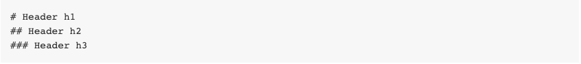
        2. Thứ hai: 
            + Kẹp một từ ở đầu và cuối bằng 1 ký tự `*` để in nghiêng, 2 ký tự `**` để bôi đậm, và 3 ký tự `***` để vừa in nghiêng vừa bôi đậm. Nếu muốn chúng ta có thể dùng gạch dưới `_` thay cho dấu sao `*`.
                > Ví dụ: 
                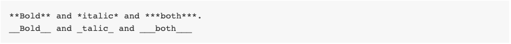
                >
            + Ngoài ra chữ có thể gạch ngang bằng 2 dấu ~~.
                > Ví dụ:
                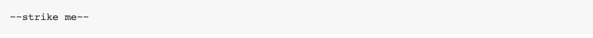
                >
        3. Thứ ba: 
            + Viết link trong markdown bằng cách cho alt text vào trong ngoặc vuông `[]` và link thật vào trong ngoặc đơn `()`.
                > Ví dụ:
                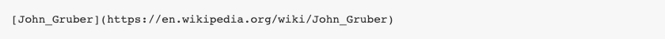
                >
            + Ngoài ra chúng ta có thể thêm tiêu đề cho link bằng cách thêm "title" trong mô tả bên trong ngoặc đơn ().
                > Ví dụ:
                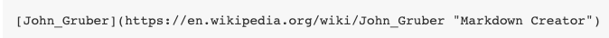
                >
        4. Thứ tư: Chèn hình ảnh trong markdown chỉ khác với chèn link đôi chút. Chúng ta thêm ký tự `!` vào đầu tiên, sau đó ghi alt text và link ảnh vào trong ngoặc vuông `[]` và ngoặc đơn `()`. Nhưng trong trường hợp sử dụng Kipalog để biên dịch thì chúng ta chỉ việc kéo, thả hoặc là copy và paste ảnh trực tiếp vào editor để bắt đầu upload.
            > Ví dụ:
            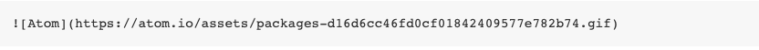
            >
        5. Thứ năm: Để định đạng một đoạn văn bản thành các gạch đầu dòng trong markdown, chúng ta dùng ký tự `*` và một dấu cách ở mỗi ý và dùng thêm 2 dấu cách ở đằng trước nếu muốn lùi vào một level. Nếu muốn dùng số để đánh dấu thì chúng ta viết số và một dấu chấm .
            > Ví dụ: 
            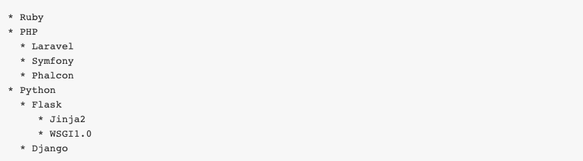
            Danh sách với số: 
            
            >
        6. Thứ sáu: Cách viết một trích dẫn giống hệt khi chúng ta vẫn trả lời bình luận hay dẫn chứng trong các diễn đàn: sử dụng ký tự `>`.
            > Ví dụ:
            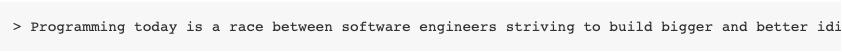
            >
        7. Thứ bảy: Áp dụng màu sắc cho văn bản. Việc này khá đơn giản, chúng ta có thể sử dụng thẻ font và sử dụng color của thẻ này như ví dụ sau Thử màu.
    * Ngữ pháp nâng cao của Markdown: Kể từ đây sẽ là các cú pháp thuộc phần nâng cao. Một số trong số này không được hỗ trợ trực tiếp bởi Markdown, nhưng được hỗ trợ bởi Kipalog.
        1. Thứ nhất: Mã code. Có 2 loại code có thể viết trong markdown: inline code (code trong dòng) và code block (đoạn code riêng). Còn code block dùng 3 ký tự phẩy ngược kẹp ở đầu và đuôi của 1 đoạn. Khi bạn muốn cú pháp hiển thị chính xác với ngôn ngữ của đoạn code thì có thể thêm định danh ngôn ngữ ở 3 ký tự phẩy ngược mở đoạn. Ngoài ra nếu cách đầu dòng 4 dấu cách cho 1 đoạn thì đoạn đó cũng sẽ được tự động nhận là một code block.
            > Ví dụ:
            
            Nhập vào:
            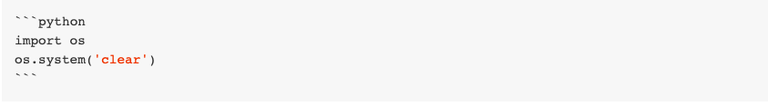
            Kết quả:
            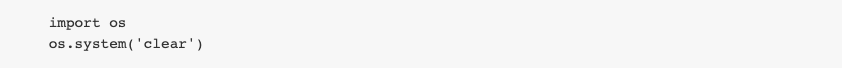
            >
        2. Thứ hai: Vẽ bảng trong Markdown sẽ hơi khó nếu bạn chưa quen. Các cột được tách nhau bằng dấu ngăn thẳng đứng | và header được tách với content bằng dấu gạch ngang -. Ở dòng ngăn cách giữa header và content bạn sẽ thấy ký hiệu căn lề trái phải (cột 2 và cột 3) bằng dấu :. Bảng trên sẽ được render thành cấu trúc HTML. Trong trường hợp chưa quen với việc kẻ bảng với markdown thì chúng ta có thể sử dụng hỗ trợ từ [link này](https://www.tablesgenerator.com/markdown_tables).
            > Ví dụ:
            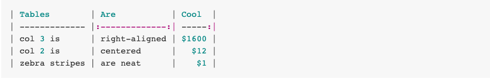
            >
        3. Thứ ba: Link tài liệu tham khảo. Markdown được thiết kế để dễ nhìn ngay ở định dạng tự nhiên. Vì vậy chúng ta có thể đánh dấu mỗi link thành từng số và viết tất cả link thực tương ứng với các số ở cuối cùng.
            > Ví dụ:
            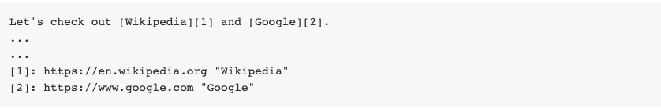
            >
        4. Thứ tư: Link nhanh. Chúng thậm chí có thể viết link trực tiếp như là https://kipalog.com/posts/Huong-dan-su-dung-Markdown-tren-Kipalog.
            > Ví dụ:
            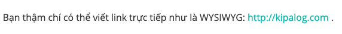
            >
### Tài liệu tham khảo.
1. [Hướng dẫn sử dụng mark down trên Kipalog.](https://kipalog.com/posts/Huong-dan-su-dung-Markdown-tren-Kipalog)
2. [Hướng dẫn sử dụng markdown cơ bản.](https://viblo.asia/p/markdown-huong-dan-su-dung-Az45bQPNlxY)     